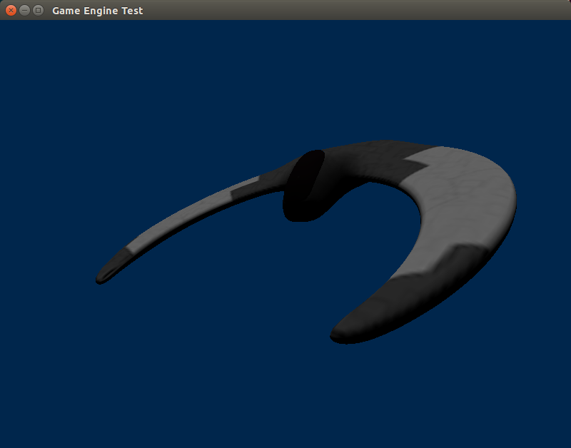

O objetivo do desafio proposto é avaliar o conhecimento do candidato e verificar se ele possui o conhecimento básico esperado para exercício das atividades esperadas.

##Desafio
O desafio consiste na correção e refatoração do código disponível seguindo os requisitos abaixo.

##Requisitos
* Deve ser corrigido o erro que possui atualmente no código, não está sendo renderizado a nave, conforme imagem exemplo abaixo.
* Melhore a legibilidade do código fonte.
* Adicione movimentação e zoom a camera.
* Adicione orientação a objetos onde achar necessário.
* C++ 11

##Plus
* Refatorar o código para que ele vire multi-plataforma (Windows e Linux), atualmente ele está configurado para OSX.
* Adicionar uma segunda nave.

##Observações
* Não reinvente a roda.
* Utilizar OO.
* De prioridade aos REQUISITOS e não ao plus.

##O que sera avaliado
* Qualidade do código ( clareza, boas práticas ).
* Desempenho.
* Entrega no prazo.

**Entrega: Deverá criar um PR deste repositório com a solução**

Qualquer duvida entrar em contato: **dev (at) itslemonade.com**

**Objetivo Esperado:**



##Observações sobre o PR:
* Desenvolvi utilizando linux (slackware), e nele renderizou uma nave, totalmente branca, como no screenshot abaixo, porém
ao tentar rodar num OS X, o mesmo resultado não aconteceu.
  Acabei por adicionar uma rotação no objeto para viasualizá-lo. Para sair do programa deve-se aperta Q ou Esc.

* Utilizado cmake para compilação. Em Linux e OS X:
    ```bash
    $ mkdir build; cd build; cmake .. && make
    ```

  Ao terminar, o executável ProjetoSDL estará na pasta ProjetoSDL/

  Tal cmake também pode ser utilizado para criar um projeto no Xcode com o comando (assumindo estar em build/):
    ```bash
    $ mkdir build; cd build; cmake -G Xcode -DCMAKE_BUILD_TYPE=Release ../ && xcodebuild
    ```

  Neste caso, o executável estará na pasta ProjetoSDL/Debug, e deverá ser copiado para ProjetoSDL/ a fim de ser executado de forma correta.

  Não utilizei o projeto Xcode que veio junto, então não sei se tal está funcionando.

* Alguns requisitos não foram resolvidos:
    - Não foi adicionado movimentação nem zoom a camera;
    - Nave não está sendo renderizada como devia.

* Por fim, estou curioso para saber a solução do problema :)


